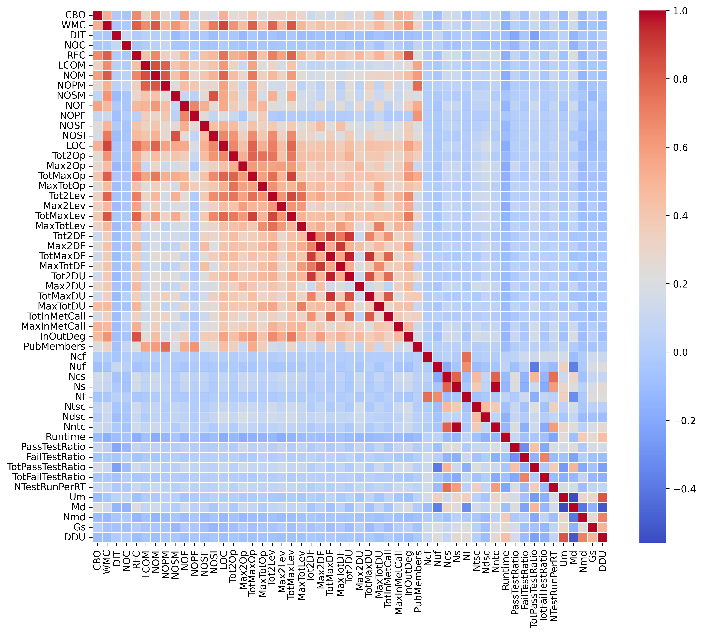
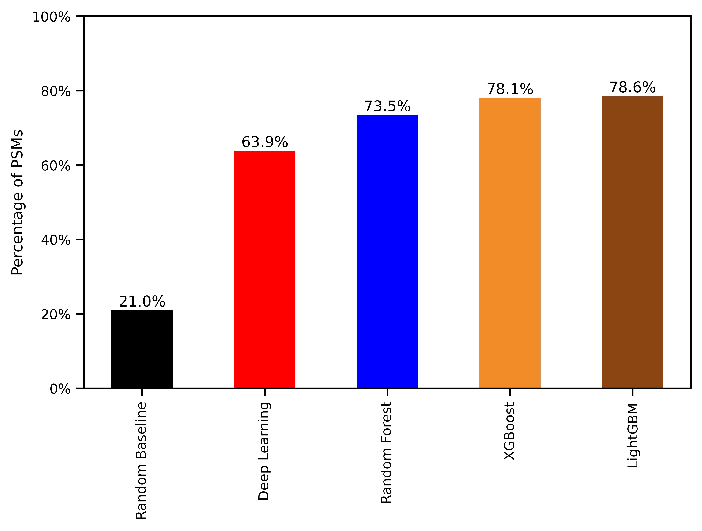
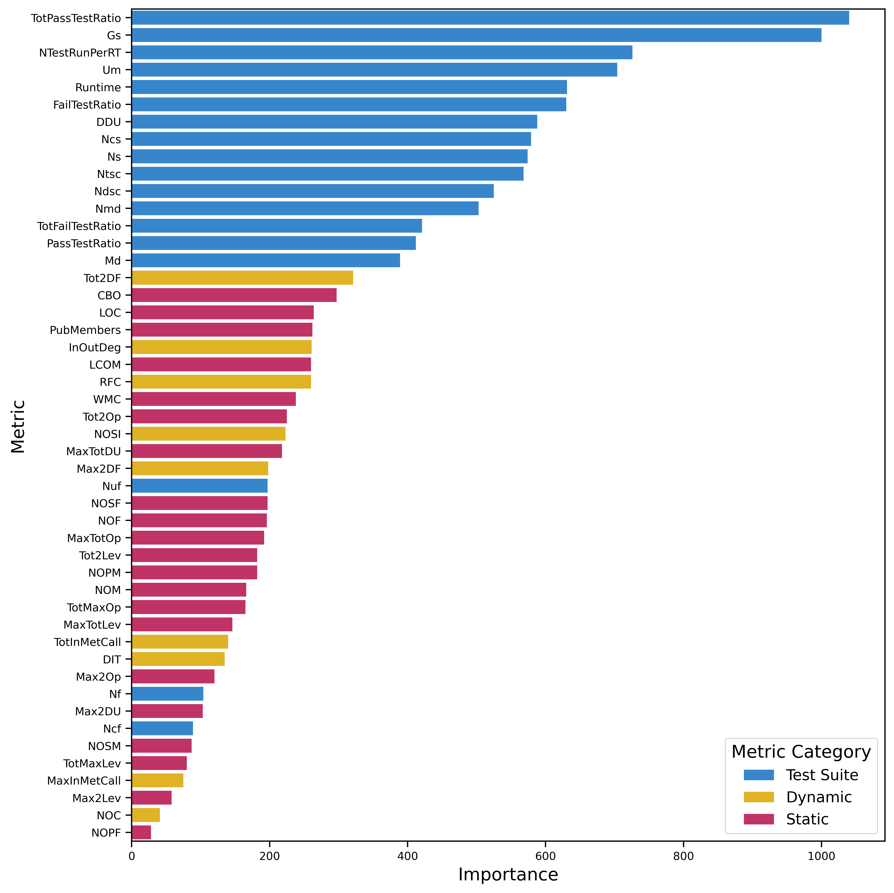

# software-metrics-fault-localization-prediction
Scripts, datasets, and notebooks for evaluating the predictive power of software metrics in fault localization across the Defects4J dataset buggy software versions.

## Publications
- Issar Arab; Kenneth Magel; and Mohammed Akour. 2025. **Evaluating the Predictive Power of Software Metrics for Fault Localization** Computers 14, no. 6: 222. https://doi.org/10.3390/computers14060222

## Prerequisites
1- Create and activate a conda environment:

		$conda create -n softmetricpred python=3.9
		$conda activate softmetricpred
  
2- Clone the repository: 

		$git clone git@github.com:issararab/software-metrics-fault-localization-prediction.git

3- Move to the repository:

		$cd software-metrics-fault-localization-prediction

4- Install packages:

		$bash install.sh

## Data availability

- To re-train the models, re-evaluate the models using the same test sets, or re-run the analysis notebook, make sure the data files are in the "data" folder, then run the notebooks. Notebooks have self-explanatory names and allows you to run all the experiments and analyses mentioned in the paper and more.

- To re-compile the dataset yourself, please refer to the "software_metrics_compilation" folder. It has all the scripts with examples and a detailed worflow of the execution plan.

## Hot stuff
- Correlation matrix of all the collected software metrics.

	

 
- Benchmarking of all different models fitted on the data and evaluated on an external 20% dataset.

	

- Best model feature importance.
  

	

