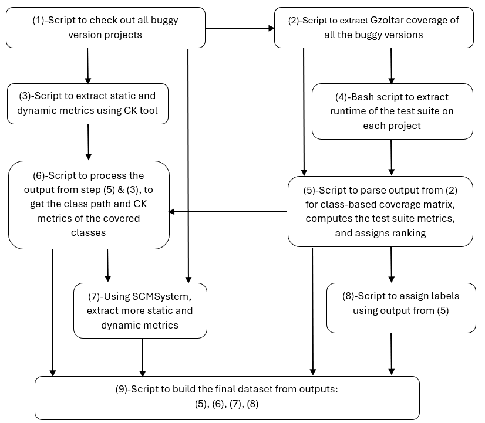

# software-metrics-fault-localization-prediction
Scripts, datasets, and notebooks for evaluating the predictive power of software metrics in fault localization across the Defects4J dataset buggy software versions.

- To re-compile the dataset yourself folder. Please folow the steps depicted and enumerated in the workflow diagram below. Each of the folders above, contains the script to execute, a sample data of 2 buggy versions, and a sub-folder showcasing the expected output. 

## Execution workflow diagram

	

